# Task Registry - AGNO

## PROTOCOLO DE REGISTRO

- POLICY: Only tasks with `Overall Status: PASS` are eligible for entry in this Registry.
- Tentativas intermediarias devem ser registradas apenas em `00_Strategy/Task_History/`.

## Estado Atual

```mermaid
flowchart LR
    T001['T001: Bootstrap'] --> T002['T002: Infra Audit'] --> T003['T003: Ingestao Legado'] --> T004['T004: Gov Sync'] --> T005['T005: Diagnostico'] --> T009['T009: Reconstrucao Corpus'] --> T010['T010: Indexacao Vetorial'] --> T011['T011: Validacao e Fix'] --> T012['T012: Extracao Cirurgica'] --> T013['T013: Plano Fase 2 - Realidade']
```

## Log de Execucao

| Timestamp (UTC) | Task ID | Status | Detalhe |
| --- | --- | --- | --- |
| 2026-02-25T14:45:00Z | T001 | DONE | Bootstrap legado concluido. |
| 2026-02-25T17:38:28Z | T002 | DONE | Auditoria de integridade aprovada. |
| 2026-02-25T18:15:42Z | T003 | DONE | Ingestao concluida. Ver `00_Strategy/Task_History/T003/report.md`. |
| 2026-02-25T18:24:50Z | T004 | DONE | Registry sincronizado com politica de `Overall PASS`. |
| 2026-02-25T18:37:08Z | T005 | DONE | Diagnostico profundo do legado concluido. |
| 2026-02-25T19:15:00Z | T011 | DONE | Sanidade RAG executada e diagrama refatorado. |
| 2026-02-25T20:25:00Z | T012 | DONE | Extracao cirurgica de inteligencia com indexacao leve. |
| 2026-02-25T20:35:00Z | T013 | DONE | Plano da Fase 2 baseado em evidencias reais da Tentativa 2. |
